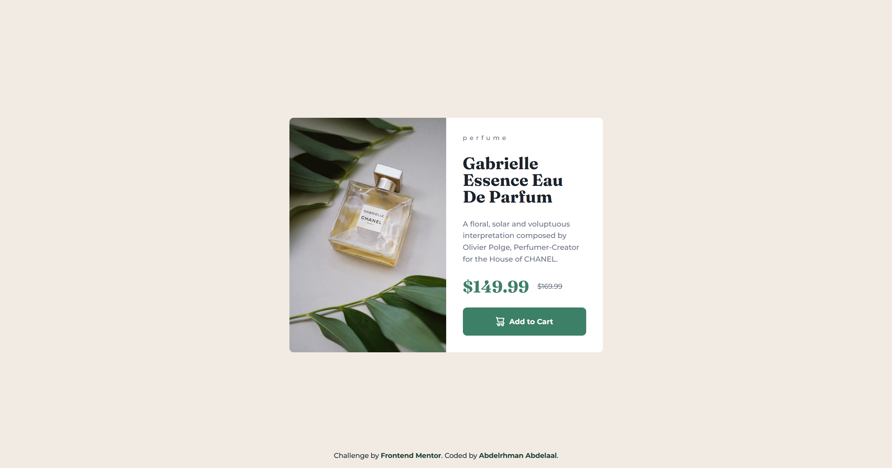

# Frontend Mentor - Single Price Grid Component solution

This is a solution to the [Single Price Grid Component challenge on Frontend Mentor](https://www.frontendmentor.io/challenges/single-price-grid-component-5ce41129d0ff452fec5abbbc). Frontend Mentor challenges help you improve your coding skills by building realistic projects.

## Table of contents

- [Overview](#overview)
  - [Screenshot](#screenshot)
  - [Links](#links)
- [My process](#my-process)
  - [Built with](#built-with)
  - [What I learned](#what-i-learned)
- [Author](#author)

## Overview

### Screenshot

### Links

- Solution URL: [GitHub](https://github.com/MrBlackvanta/single-price-grid-component)
- Live Site URL: [Netlify](https://vanta-single-price-grid-component.netlify.app)

## My process

### Built with

- React 19 + Vite 8
- TypeScript (strict mode)
- Tailwind CSS v4 — `@theme` for design tokens, `@utility` for typography presets (`text-preset-*`) and reusable component classes (`btn-primary`, `footer-link`)
- Path aliases via `baseUrl: "src"` + Vite 8's native `resolve.tsconfigPaths` option for clean imports like `import { CartSVG } from "assets"`
- Mobile-first responsive layout — stacked on mobile, two-column at the `md` breakpoint
- `<picture>` + `<source>` for art-directed responsive hero image (mobile vs desktop variants)
- Semantic HTML: `<figure>` / `<figcaption>` for the product card, `<main>` / `<footer>` for page structure, proper heading hierarchy
- Custom SVG icon as a typed React component (`React.SVGProps<SVGSVGElement>`)
- Google Fonts (Montserrat + Fraunces) — URL trimmed to only the weights actually used

### What I learned

- **Static vs. imported assets in Vite.** Plain-string paths like `/src/assets/...` work in dev but 404 in production — Vite only processes assets that are either `import`ed (so they get fingerprinted into `dist/assets/`) or placed in `public/` (copied verbatim at stable URLs). For the LCP image I chose `public/` so the URL is stable enough to `<link rel="preload">` from `index.html` — the browser can then discover and start downloading the image before the JS bundle even parses.
- **WebP for the hero image.** Converting the two product variants from JPEG to WebP cut their transfer size ~60% (desktop 45 KB → 18 KB, mobile 29 KB → 12 KB) with no visible quality loss. Direct LCP win on mobile connections.
- **Tailwind v4 `@utility` for component classes.** The `@utility` directive composes multiple `@apply` rules into a single, reusable class — cleaner than repeating long className strings across JSX, while keeping all styles in the Tailwind layer.
- **Accessibility patterns for product cards:**
  - `<s>` + `aria-label="Original price"` for the struck-through price, so screen readers convey the discount semantics instead of reading two identical-sounding numbers.
  - `aria-hidden="true"` on decorative SVGs (the cart icon) to keep them out of the accessibility tree.
  - Descriptive `alt` text sourced from the data layer rather than duplicating the product title.
  - Visible `focus-visible` rings on every interactive element for keyboard users.
- **`Intl.NumberFormat` for currency.** Safer than `` `${price}` `` — it guarantees two-decimal output regardless of the raw number and localizes correctly if the app is ever translated.
- **LCP / CLS hygiene on hero images.** `fetchPriority="high"`, `decoding="async"`, and per-breakpoint `width`/`height` attributes (on `<source>` for desktop 600×900 and on `` for mobile 686×480) so the browser reserves the correct aspect ratio *for the variant it's actually going to render* — a single set of dimensions on `` alone is wrong as soon as the art-directed variants have different ratios.
- **Preloading the LCP image with media queries.** Two `<link rel="preload" as="image">` tags in `<head>`, each scoped by `media="(max-width: 767px)"` / `media="(min-width: 768px)"`, so the browser preloads only the variant that actually matches the current viewport. Big LCP improvement on mobile.
- **Non-blocking webfont CSS.** Loading Google Fonts' stylesheet with `rel="preload" as="style"` + an `onload` swap to `rel="stylesheet"` (plus a `<noscript>` fallback) so the CSS request no longer blocks first paint.
- **`prefers-reduced-motion`** handled globally in CSS, neutralizing transitions/animations for users who opt out at the OS level.
- **Path aliases need a runtime resolver.** TypeScript's `baseUrl` + `paths` only handle typechecking; the bundler has to resolve the same aliases at build time. Vite 8 ships this natively as `resolve.tsconfigPaths: true`, replacing what used to require the `vite-tsconfig-paths` plugin.
- **Pixel-perfect vs. scale values.** Following the Figma spec (e.g. the button's `p-[17.5px]`) over forcing values into the default Tailwind spacing scale — arbitrary values are the right tool when the design calls for them.

## Author

- UpWork - [Abdelrhman Abdelaal](https://upwork.com/freelancers/~01f0a9479696b61f49)
- Frontend Mentor - [@MrBlackvanta](https://www.frontendmentor.io/profile/MrBlackvanta)
- LinkedIn - [@yourusername](https://www.linkedin.com/in/abdelrhman-vanta/)
